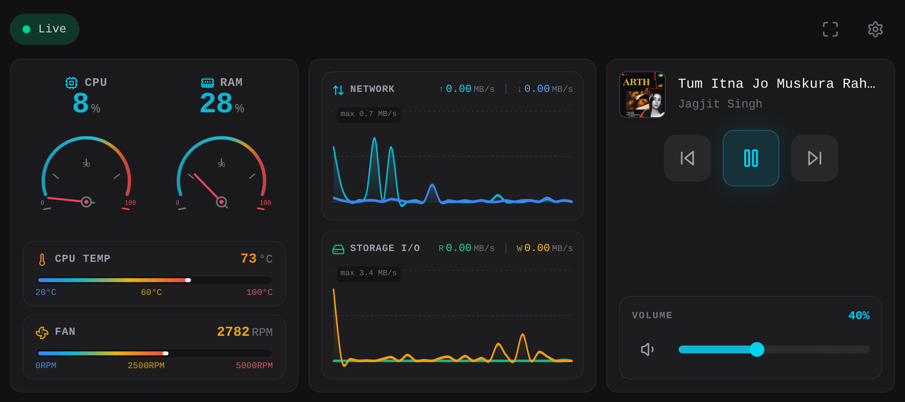

# DeskLink: Fedora Telemetry & Control Kiosk

An ultra-responsive, dark-mode-first cyberpunk kiosk dashboard and headless telemetry daemon for Linux (optimized for Fedora 40+, with full native support for Ubuntu / Debian and Arch Linux). Designed to turn old Android smartphones, tablets, iPads, or secondary screens into dedicated desktop vitals and media control monitors.

---

## 📸 Overview & Architecture

<p align="center">
  
</p>
<!-- Note: Replace the image above with your actual screenshot: docs/screenshots/dashboard-preview.png -->

```
┌─────────────────────────────────────────────────────────────────────────┐
│                    DESKLINK KIOSK ARCHITECTURE                          │
│                                                                         │
│  [ Linux Host (Fedora / Ubuntu / Debian / Arch) ]                       │
│    ├── collector.py ──> psutil + /sys/class/hwmon + playerctl           │
│    ├── controller.py ─> playerctl MPRIS2 + wpctl/pactl volume           │
│    ├── discovery.py ──> UDP Auto-Discovery Beacon (port 9999)           │
│    └── app.py ────────> Flask + WebSockets + Static Hosting (:8000)     │
│                               │                                         │
│                               │ (LAN WebSocket + HTTP)                  │
│                               ▼                                         │
│  [ Any Client Device (Phone / Tablet / iPad / Browser) ]                │
│    └── desklink-ui ───> React 18 + Tailwind v4 + TypeScript (:8000)     │
│         ├── Panel A: Analog CPU & RAM Gauges (Digits On Top) +          │
│         │            Horizontal Dynamic Temp & Fan Bars (Blue/Yel/Red)  │
│         ├── Panel B: Smooth Rate Splines (Top: Net, Bottom: Storage)    │
│         │            with Top-Left Max Scale Readout                    │
│         └── Panel C: Media Controller (Now Playing, Artwork, Transport) │
│                      + System Audio Volume Slidebar                     │
└─────────────────────────────────────────────────────────────────────────┘
```

---

## ✨ Features

- **Cyberpunk High-Density Aesthetics**: Matte zinc backdrop (`bg-zinc-950`), glowing accents, analog speedometer-style needle gauges, real-time scrolling area graphs with smooth cubic Bézier splines, and fixed-width `tabular-nums` typography.
- **Hardware Telemetry (1.0s real-time broadcast)**:
  - **Analog CPU & RAM Dial Meters**: Realistic analog dial meters with physical-style mechanical needles, calibration tick marks, warning zones, and **prominent numeric readouts displayed directly on top**.
  - **Single-Column Stacked Temperature & Fan Speed Bars**:
    - Arranged vertically in a clean single column on Panel A (CPU Temp on top, Fan speed below).
    - Features a **dynamic Blue $\rightarrow$ Yellow $\rightarrow$ Red color progression**:
      - Cool / idle readings illuminate in vibrant **Blue** (`#3b82f6`).
      - Moderate levels transition smoothly into warm **Yellow** (`#eab308`).
      - Elevated / high loads progress into glowing **Red** (`#ef4444`).
    - Calibrated scales (20–100°C for Temp, 0–5000 RPM for Fan) with glowing leading edges.
  - **Smooth Spline Rate Graphs (Stacked Top / Bottom)**:
    - **Smooth Bézier Splines**: Both line strokes and gradient area fills curve smoothly without jagged polygons or sharp points.
    - **Top Graph (Network Traffic)**: Real-time scrolling area graph showing Upload (↑) and Download (↓) throughput in MB/s with auto-scaling Y-axis.
    - **Bottom Graph (Storage I/O)**: Real-time scrolling area graph showing Disk Read (R) and Disk Write (W) throughput in MB/s.
    - **Top-Left Scale Badge**: Dynamic peak scale indicator (`max X.X MB/s`) positioned unobtrusively in the **top-left corner** of each chart.
- **MPRIS2 Media Controller**:
  - Full transport controls (`Previous`, `Play/Pause`, `Next`) via `playerctl`.
  - Now Playing track title and artist.
  - **Album Artwork Display & Lightbox Zoom**: Safely proxies local player covers (`file:///tmp/...`) and remote artwork over HTTP (`/api/art`). Tap the artwork thumbnail to view full-size in a lightbox modal.
  - Non-blinking stable hashing so artwork persists smoothly without re-rendering every second.
- **System Audio Volume Slider**:
  - Touch-friendly horizontal volume slidebar with mute toggle and live percentage readout (controls PipeWire / WirePlumber via `wpctl` on Fedora/modern systems, with automatic `pactl` fallback for Ubuntu/Debian PulseAudio).
- **Kiosk & Multi-Device Guardrails**:
  - **HTML5 Fullscreen Mode**: Dedicated Fullscreen toggle to hide browser chrome and address bars.
  - **Screen WakeLock API**: Prevents the tablet/smartphone display from dimming or locking while the dashboard is active.
  - **Tablet & Smartphone Adaptive Layout**: Responsive grid that adapts smoothly between ultra-wide smartphone landscape (3-column) and squarer/portrait tablet screens (scrollable 1-column).
  - **Touch Target Optimization**: Touch targets are minimum 48×48px with tactile active press animations.
  - **Zero-Flicker Split-State Engine**: High-frequency metrics update in an external React store via `useSyncExternalStore` without triggering re-renders in the media/volume controller.
  - **Auto-Detect IP & Reconnection FSM**: Exponential backoff reconnection loop that automatically resolves the host IP of any client device connecting over LAN.
  - **UDP Auto-Discovery**: Built-in broadcast beacon listening on port `9999` responding to `"WHO_IS_DESK_SERVER"`.
  - **Single-Command Concurrent Dev Workflow**: Run both backend API daemon and Vite frontend dev server with hot reloading simultaneously via `npm run dev:all` or `npm start`.

---

## 📋 System Prerequisites

| Component | Minimum Version | Fedora Notes | Ubuntu / Debian Notes |
|---|---|---|---|
| **Python** | 3.11+ / 3.14+ | Default Python 3 | Python 3 + `python3-venv` |
| **Node.js** | 18.0+ / 20.0+ / 24.0+ | Required only to build UI | Required only to build UI |
| **playerctl** | Any recent version | `dnf install playerctl` | `apt install playerctl` |
| **Audio Subsystem** | PipeWire or PulseAudio | WirePlumber (`wpctl`) default on Fedora 40+ | `wpctl` (Ubuntu 24.04+) or `pactl` (`pulseaudio-utils`) |

---

## 📦 Installation & Setup Guide

### 1. Install System Packages

#### On Fedora Linux (Fedora 40+)
```bash
sudo dnf install -y python3 python3-pip playerctl git
```

#### On Ubuntu / Debian Linux (Ubuntu 22.04 / 24.04 LTS)
Ubuntu and Debian separate virtual environment tools and PulseAudio utilities into dedicated packages:
```bash
sudo apt update
sudo apt install -y python3 python3-pip python3-venv playerctl pulseaudio-utils git
```
> **Ubuntu Audio Note:** Ubuntu 24.04+ includes PipeWire with `wpctl` out of the box. For Ubuntu 22.04 LTS or standard PulseAudio installations, `pulseaudio-utils` provides `pactl`, which DeskLink automatically detects and uses for the system volume slider.

#### On Arch Linux / Manjaro
```bash
sudo pacman -S python python-pip playerctl git
```

---

### 2. Clone the Repository
```bash
git clone https://github.com/your-username/DeskLink.git
cd DeskLink
```

---

### 3. Setup Python Backend

```bash
cd api

# Create a virtual environment with system site package access
python3 -m venv --system-site-packages .venv
source .venv/bin/activate

# Install Python requirements
pip install -r requirements.txt
```

> **Ubuntu / Debian Note:** Ubuntu enforces PEP 668 (externally managed environments). The `--system-site-packages` flag ensures DeskLink runs smoothly in its `.venv` while still accessing system bindings like `psutil`.

---

### 4. Build the Frontend UI (React + Vite + Tailwind CSS)

```bash
cd ../ui

# Install dependencies and build static assets
npm install
npm run build
```

> **Note:** The compiled assets are placed into `ui/dist/`. The Python Flask server automatically serves these static files directly on port `8000`.

---

## 🚀 Running DeskLink

### Mode 1: Unified Kiosk Server (Recommended)
You only need to run the Python server. It serves the REST API, WebSocket telemetry, album art proxy, and the compiled React UI all on port `8000`:

```bash
cd api
.venv/bin/python3 app.py
```

Console output:
```
[INFO] __main__: Starting desklink server on 0.0.0.0:8000
[INFO] discovery: Discovery beacon listening on UDP 0.0.0.0:9999
 * Running on http://127.0.0.1:8000
 * Running on http://192.168.0.x:8000
```

---

### Mode 2: Live Development Mode with Concurrently (Single Command)
If developing or modifying components with hot module replacement (HMR), start both the Python API daemon and Vite frontend dev server together in a single command using `concurrently`:

```bash
cd ui
npm run dev:all
# or simply:
npm start
```

This concurrently orchestrates:
- **`[api]`**: Starts the Python backend daemon on port `8000`.
- **`[ui]`**: Starts the Vite dev server on port `5173` with network access (`--host`), proxying WebSocket (`/ws`) and album art (`/api`) to `:8000`.

---

## 📱 How to Use on Any Connected Device (Phone, Tablet, Laptop)

Any device connected to the same Wi-Fi or local area network can open the dashboard in any web browser.

### 1. Find Your Linux Host IP
On your host machine, run:
```bash
hostname -I | awk '{print $1}'
```
*Example IP: `192.168.0.10`*

### 2. Open on Your Tablet / Smartphone
1. Open Chrome, Safari, Firefox, or **Fully Kiosk Browser** on your tablet or smartphone.
2. Navigate to:
   ```
   http://192.168.0.10:8000
   ```
   *(Replace `192.168.0.10` with your machine's actual IP address)*
3. The dashboard will automatically detect the server IP and establish a live WebSocket connection.
4. **Enable Fullscreen**: Tap the **Maximize** icon in the top header bar to hide the browser address bar and enter full-screen kiosk mode.
5. **Album Art Zoom**: Tap any playing track's album art thumbnail to expand it in high resolution.
6. **Volume Slider**: Drag or tap along the volume slidebar to adjust system volume smoothly.
7. **Auto-Detect / Change IP**: If you ever change Wi-Fi networks, tap the **Connection Badge** (or the **Settings Gear**) and tap **"Auto-detect IP"** to reconnect instantly.

---

## ⚙️ Running Headless as a systemd Service (Autostart on Boot)

To have DeskLink start automatically when your Linux machine boots or logs in, set up a systemd user service.

### Recommended: User Service (Full MPRIS & Audio Session Access)
Running as a `systemd --user` service is strongly recommended so `playerctl`, `wpctl`, and `pactl` can access your desktop user D-Bus and audio session without root permissions:

1. Create the systemd user service directory:
   ```bash
   mkdir -p ~/.config/systemd/user
   ```

2. Copy the included service file or create `~/.config/systemd/user/desklink.service`:
   ```ini
   [Unit]
   Description=DeskLink Telemetry & Control Kiosk Server
   After=network-online.target sound.target
   Wants=network-online.target

   [Service]
   Type=simple
   WorkingDirectory=%h/Music/antigravity/desk-gadget
   ExecStart=%h/Music/antigravity/desk-gadget/.venv/bin/python3 app.py
   Restart=on-failure
   RestartSec=5
   Environment=PYTHONUNBUFFERED=1

   [Install]
   WantedBy=default.target
   ```
   *(Ensure `WorkingDirectory` and `ExecStart` match your actual path)*

3. Enable and start the service:
   ```bash
   systemctl --user daemon-reload
   systemctl --user enable --now desklink.service
   ```

4. Check status and live logs:
   ```bash
   systemctl --user status desklink.service
   journalctl --user -u desklink.service -f
   ```

---

## 🐧 Ubuntu / Debian Dedicated Setup Guide

If deploying DeskLink on Ubuntu (Desktop or Server) or Debian:

1. **Install Prerequisites**:
   ```bash
   sudo apt update
   sudo apt install -y python3 python3-pip python3-venv playerctl pulseaudio-utils
   ```
2. **Audio Volume Control**:
   - DeskLink automatically detects whether your system runs PipeWire (`wpctl`) or PulseAudio (`pactl`).
   - If using Ubuntu 22.04 LTS, `pactl` will handle volume commands seamlessly.
3. **Firewall Setup on Ubuntu (`ufw`)**:
   Ubuntu frequently uses `ufw` by default. Open the required ports:
   ```bash
   sudo ufw allow 8000/tcp comment "DeskLink Web & WebSocket"
   sudo ufw allow 9999/udp comment "DeskLink UDP Auto-Discovery"
   sudo ufw reload
   ```
4. **Media Players under Ubuntu**:
   Ensure media players like Spotify (Snap or Deb), VLC, Rhythmbox, or web browsers (Chrome/Firefox) are running in the user session. DeskLink communicates with them via the MPRIS2 D-Bus interface.

---

## 📡 API & Protocol Specifications

### 1. WebSocket Endpoint (`ws://<host>:8000/ws`)
- **Server Broadcast (every 1.0s)**:
  ```json
  {
    "ts": 1789289036.12,
    "cpu_percent": 14.5,
    "mem_percent": 28.2,
    "net_send_mbps": 0.45,
    "net_recv_mbps": 1.82,
    "disk_read_mbps": 0.10,
    "disk_write_mbps": 0.25,
    "cpu_temp_c": 54.0,
    "fan_rpm": [{"label": "fan", "rpm": 2100}],
    "media": {
      "title": "Song Title",
      "artist": "Artist Name",
      "status": "Playing",
      "art_url": "/api/art?v=a1b2c3d4"
    },
    "volume": 65
  }
  ```

- **Client Commands**:
  Send a JSON message over the WebSocket:
  ```json
  {"command": "set_volume", "value": 75}
  ```
  Supported commands:
  - `{"command": "media_play_pause"}`: Toggle play / pause on active MPRIS player
  - `{"command": "media_next"}`: Skip to next track
  - `{"command": "media_prev"}`: Skip to previous track
  - `{"command": "set_volume", "value": <0-100>}`: Adjust PipeWire (`wpctl`) or PulseAudio (`pactl`) master volume

### 2. Album Art Endpoint (`GET /api/art?v=<hash>`)
- Returns the artwork of the currently playing track with CORS and caching headers. Supports local files (`image/png`, `image/jpeg`) and remote web URLs.

### 3. UDP Discovery Beacon (Port `9999`)
- Send UDP datagram `"WHO_IS_DESK_SERVER"` to broadcast address `255.255.255.255:9999`.
- Daemon responds:
  ```json
  {"server": "fedora-desk", "ws_port": 8000}
  ```

---

## 🛠️ Troubleshooting

- **Media information shows "Stopped" or buttons do nothing**:
  Verify `playerctl` is installed and can see players:
  ```bash
  playerctl status
  playerctl metadata
  ```
  Ensure your media player (Spotify, Brave, Chrome, VLC, Amberol) supports MPRIS2 and is actively running.
- **Volume slider does not change audio**:
  - On Fedora / modern PipeWire systems:
    ```bash
    wpctl get-volume @DEFAULT_AUDIO_SINK@
    wpctl set-volume @DEFAULT_AUDIO_SINK@ 0.5
    ```
  - On Ubuntu / PulseAudio systems:
    ```bash
    pactl get-sink-volume @DEFAULT_SINK@
    pactl set-sink-volume @DEFAULT_SINK@ 50%
    ```
- **Connection badge shows "Offline" on a tablet**:
  Tap the badge or gear icon, click **"Auto-detect IP"**, and verify the IP matches your Linux machine's local IP (e.g. `192.168.0.x:8000`).
- **Firewall Blocking**:
  If other devices on your LAN cannot load port 8000:
  - **Fedora (`firewalld`)**:
    ```bash
    sudo firewall-cmd --add-port=8000/tcp --permanent
    sudo firewall-cmd --add-port=9999/udp --permanent
    sudo firewall-cmd --reload
    ```
  - **Ubuntu (`ufw`)**:
    ```bash
    sudo ufw allow 8000/tcp
    sudo ufw allow 9999/udp
    sudo ufw reload
    ```

---

## 📄 License
This project is open-source and licensed under the [MIT License](LICENSE). Built for Linux desktop enthusiasts.
